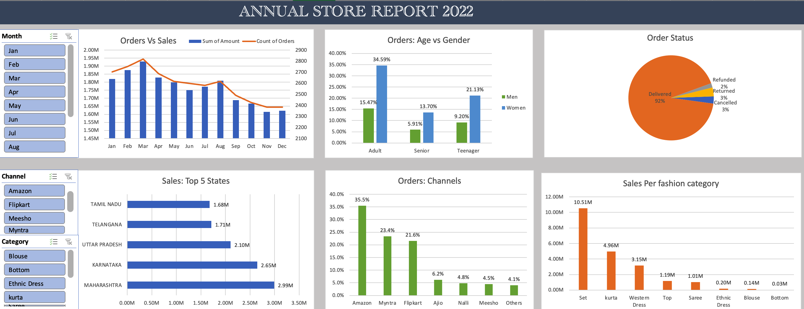

# Fashion Store Sales analysis

## Introduction
---
This is a Microsoft Excel project on the sales analysis of an online clothing store in India for 2022. The project analyzes the data and creates a report that can help the store make better decisions to maximize it's sales.

## Problem statement
The store would obvioulsy like to have better sale numbers in the next year, so the following metrics would be used to derive actionable insights that can help the store:

1. Which month had the highest orders and sales
2. Top 5 states contributing to the sales
3. The channels/platforms most sales came from
4. Relationship between Age and Gender in Relation to Sales

## Skills demonstrated
- Data cleaning
- Pivot tables
- Pivot charts
- Dashboard

## Visualization

## Analysis
- The store had a total of 31,047 orders with the month of March having the most orders. 

- Men and Women between the ages of 30 and 50 had the most orders and purchases but Women ordered and bought more items.

- Maharashtra, Karnataka, Uttar Pradesh, Telangana, and Tamil Nadu were the top 5 states in sales respectively.

- Amazon was the channel that was used the most in buying from the store with 35.5% of the orders coming from there. Myntra and Flipkart were the second and third platforms with the most orders with 23.4% and 21.6% of the total orders respectively.

- Set, Kurta, Western dress, Top, Saree, Ethnic dress, Blouse, and Bottom were the categories of clothing sold in the store but set and kurta was the most ordered and purchased. After a little research, the possible explanation for this would be that, in March, India gets high in temperature and is sunny and dry. Set and Kurta are good clothing for this season as they are light cotton clothes.

## Conclusion and Recommendation
- The store should aim to target women between the ages of 30 and 50 with ads/offers of sets and Kurta on Amazon, Myntra, and Flipkart.

- The store should sell more light cotton items such as kurta during sunny and dry seasons.

- The store should run a survey for men asking whether they are interested in buying male cultural clothing as the men bought more of western clothes. This survey can help them decide on whether they should add more categories of male cultural attire to the store to maximize their sales.
 
Thank you for reading!!

